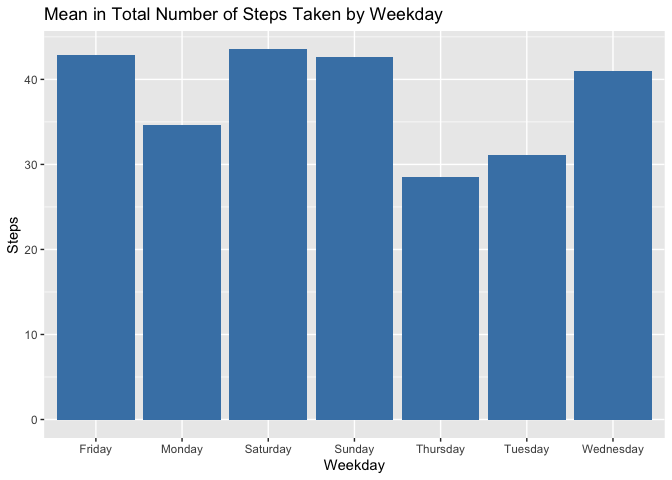

## Loading and preprocessing the data

### First

We start by charge the libaries that we will use


```r
library(dplyr)
```

```
## 
## Attaching package: 'dplyr'
```

```
## The following objects are masked from 'package:stats':
## 
##     filter, lag
```

```
## The following objects are masked from 'package:base':
## 
##     intersect, setdiff, setequal, union
```

```r
library(ggplot2)
```
### second

We loading the file and turning it into a df table to facilitate its processing and see the first rows.


```r
activity<- read.csv("/Users/johnsprockel/Documents/GitHub/ProgrammingAssignment2/activity.csv")
activity<- tbl_df(activity)
```

```
## Warning: `tbl_df()` is deprecated as of dplyr 1.0.0.
## Please use `tibble::as_tibble()` instead.
## This warning is displayed once every 8 hours.
## Call `lifecycle::last_warnings()` to see where this warning was generated.
```

```r
head(activity)
```

```
## # A tibble: 6 x 3
##   steps date       interval
##   <int> <chr>         <int>
## 1    NA 2012-10-01        0
## 2    NA 2012-10-01        5
## 3    NA 2012-10-01       10
## 4    NA 2012-10-01       15
## 5    NA 2012-10-01       20
## 6    NA 2012-10-01       25
```
### Third

We review the summary of the file finding that:

-Its length is 17568 data

-has 2304 NA's

Now we proceed to eliminate NA's 


```r
summary (activity)
```

```
##      steps            date              interval     
##  Min.   :  0.00   Length:17568       Min.   :   0.0  
##  1st Qu.:  0.00   Class :character   1st Qu.: 588.8  
##  Median :  0.00   Mode  :character   Median :1177.5  
##  Mean   : 37.38                      Mean   :1177.5  
##  3rd Qu.: 12.00                      3rd Qu.:1766.2  
##  Max.   :806.00                      Max.   :2355.0  
##  NA's   :2304
```

```r
activity<- activity[!is.na(activity$steps),]
```

-the minimum value of steps is 0 and the maximum is 806, its mean is 37 and median is 0

-the minimum value of interval is 0 and the maximum is 2355, its mean and median are 1177.5.

### Fourth

We proceed to change the date variable to said format to obtain the tidy data.


```r
activity$date<- as.Date(as.character(activity$date))
summary(activity)
```

```
##      steps             date               interval     
##  Min.   :  0.00   Min.   :2012-10-02   Min.   :   0.0  
##  1st Qu.:  0.00   1st Qu.:2012-10-16   1st Qu.: 588.8  
##  Median :  0.00   Median :2012-10-29   Median :1177.5  
##  Mean   : 37.38   Mean   :2012-10-30   Mean   :1177.5  
##  3rd Qu.: 12.00   3rd Qu.:2012-11-16   3rd Qu.:1766.2  
##  Max.   :806.00   Max.   :2012-11-29   Max.   :2355.0
```

## What is mean total number of steps taken per day?

Initially the table is grouped by date, then we generate a new table with the sum, mean and median of steps for each day.


```r
activity<- group_by(activity, date)
x<- summarise(activity, sum= sum(steps), mean = mean (steps), median = median(steps))
```

```
## `summarise()` ungrouping output (override with `.groups` argument)
```

```r
x
```

```
## # A tibble: 53 x 4
##    date         sum   mean median
##    <date>     <int>  <dbl>  <dbl>
##  1 2012-10-02   126  0.438      0
##  2 2012-10-03 11352 39.4        0
##  3 2012-10-04 12116 42.1        0
##  4 2012-10-05 13294 46.2        0
##  5 2012-10-06 15420 53.5        0
##  6 2012-10-07 11015 38.2        0
##  7 2012-10-09 12811 44.5        0
##  8 2012-10-10  9900 34.4        0
##  9 2012-10-11 10304 35.8        0
## 10 2012-10-12 17382 60.4        0
## # … with 43 more rows
```

The total steps of each day are plotted.


```r
g<-ggplot(x, aes(date, sum)) 
g+ geom_bar(stat="identity", fill = "red") +
  ggtitle("Total Number of Steps Taken Each Day") +
  xlab("Date") + ylab("Sum Steps")
```

<!-- -->

The mean of total steps of each day are plotted.


```r
g<-ggplot(x, aes(date, mean)) 
g+ geom_bar(stat="identity", fill = "steelblue") +
  ggtitle("Mean of Total Number of Steps Taken Each Day") +
  xlab("Date") + ylab("Mean Steps")
```

<!-- -->

The mean of total steps of each day are plotted.


```r
g<-ggplot(x, aes(date, median)) 
g+ geom_bar(stat="identity", fill = "steelblue") +
  ggtitle("Median of Total Number of Steps Taken Each Day") +
  xlab("Date") + ylab("Median Steps")
```

<!-- -->

Each day, the median was 0.

## What is the average daily activity pattern?

This is a time series plot of the average number of steps taken.


```r
g<-ggplot(x, aes(date, mean)) 
g+ geom_line(color = "steelblue") +
  ggtitle("Mean of Total Number of Steps Taken Each Day") +
  xlab("Date") + ylab("Mean Steps")+
  theme_bw(base_family = "Times")
```

<!-- -->

## The 5-minute interval that, on average, contains the maximum number of steps

Create an data table with steps and interval and grouped by interval, then calculate the mean for each interval.


```r
con<- cbind(activity$steps, activity$interval)
con<- as.data.frame(con)
con<- group_by(con, con[,2])

y<- summarise(con, mean = mean (V1))
```

```
## `summarise()` ungrouping output (override with `.groups` argument)
```

```r
colnames(y)<- c("steps", "interval")
y
```

```
## # A tibble: 288 x 2
##    steps interval
##    <int>    <dbl>
##  1     0   1.72  
##  2     5   0.340 
##  3    10   0.132 
##  4    15   0.151 
##  5    20   0.0755
##  6    25   2.09  
##  7    30   0.528 
##  8    35   0.868 
##  9    40   0     
## 10    45   1.47  
## # … with 278 more rows
```

Now plot the average by interval


```r
g<-ggplot(y, aes(interval, steps)) 
g+ geom_line(color = "green") +
  ggtitle("Mean of Total Number of Steps Taken by Interval") +
  xlab("Interval") + ylab("Mean Steps")+
  theme_bw(base_family = "Times")
```

<!-- -->

## Imputing missing values

The code for the strategy to impute missing data was worked on in the third step of the first part

## Are there differences in activity patterns between weekdays and weekends?

Firts we do an table with steps and dates


```r
can<- cbind(activity$steps, activity$date)
can<- as.data.frame(can)
can<- mutate(can, day= weekdays(activity$date))
can<- group_by(can, day)

z<- summarise(can, mean = mean (V1))
```

```
## `summarise()` ungrouping output (override with `.groups` argument)
```

We proceed to graph the relationship of the different days of the week.


```r
g<-ggplot(z, aes(day, mean)) 
g+ geom_bar(stat="identity", fill = "steelblue") +
  ggtitle("Mean in Total Number of Steps Taken by Weekday") +
  xlab("Weekday") + ylab("Steps")
```

<!-- -->
